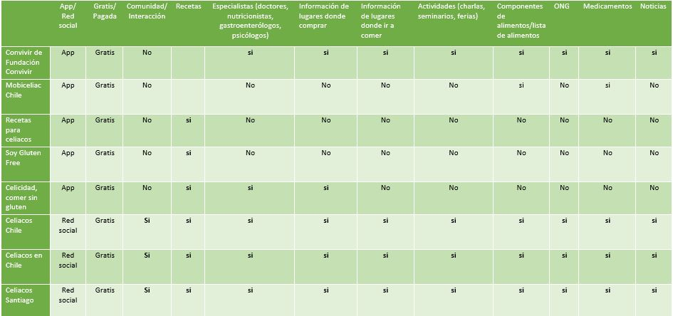

# Red Social: CeliBook
¡Bienvenidos a una red social creada especialmente para personas intolerantes el gluten y celiacos!. Aquí encontrarás lugares donde comprar, donde ir a comer, productos que puedes consumir y una gran comunidad en la que podrás compartir tus recetas, tus propios datos y conocer a más personas que viven como tu. 

### Definición del producto

Las redes sociales estan presentes en la vida de todas las personas: vivimos conectados hablando por Whatsapp, compartiendo publicaciones en Facebook, fotos en Instagram e informandonos al instante en Twitter. Todas estas redes nos permiten crear comunidad y comenzar agruparnos de acuerdo a nuestros interes y actividades. Tenemos amigos, seguidores, damos me gusta e incluso hacemos grupos de temas en específicos. 

Es así como seleccionamos el tema de alimentación presentado en el proyecto y debido a la contigencia, nos enfocamos en un grupo en especifico que son las *personas celiaca e intolerantes al gluten*.

Se estima que en Chile el <b> 1% por ciento de la población padece de intolerancia al gluten,</b> que es la proteína presente en el trigo, centeno y cebada. Es decir más de 97 mil chilenos, esto según la Fundación Convivir. 

Esta se da con más frecuencia en mujeres que en hombres, no habiendo edades más vulnerables que otras. Según el doctor Dr. Juan Francisco Miquel, gastroenterólogo de la Pontificia Universidad Católica en entrevista para el diario La Tercera en enero del 2016.

<b>Los alimentos para celiacos son tres veces más caros </b> (según el INTA), ejemplo de ello es que un paquete de fideos regular tiene un costo de 630 pesos, mientras que sin gluten, su valor asciende a 1.940 pesos. En tanto, para el pan de molde el precio regular es de 1.000 pesos, mientras que el que no tiene gluten sube a 3.049 pesos.

Con esta información podemos comenzar a identificar cuales son las necesidades de nuestros usuarios, como saber donde comprar productos que esten certificados para ellos, averiguar a que especialista dirigirse en caso de tener una crisis e incluso ver donde poder salir a comer cuando eres celiaco o intolerante al gluten.

Para continuar conociendo a nuestros usuarios hicimos un <b>benchmark</b> de las prinicipales app y grupos en Facebook que trabajan el tema.

Además de realizar un formulario dirigido a personas que son celiacas. Para conocer el formulario [Click Aqui](https://goo.gl/forms/VBogzX7thPG66X622/)

Con esto logramos concluir los elementos básicos de esta red social:
*Generar una comunidad en la que las personas se puedan comunicar de manera rápida y fácil.
*Informar acerca de locales en los que las personas pueden comprar sus productos certificados.
*Publicar al instante las preparaciones, ofertas, talleres o actividades que las personas van realizando/participando.
*Informar sobre a que organizaciones y especialistas recurrir.

### Principales usuarios 
*Audiencia Primaria: Personas entre 18 y 35 años. Estudiantes, profesionales, dueñas/os de casa u otro oficio. Con acceso a internet contante, usuario de redes sociales que tengan intolerancia al gluten, que desea y esta interesado en ser parte de una red social libre de Gluten.

*Audiencia Secundaria: Personas entre 20 y 49+ años,  que tiene un familiar con el que vive o esta a cargo de su alimentación y este padece de intolerancia al gluten. Con acceso a internet contante, con redes sociales. Que desea acceder a una red para compartir y conocer datos, recetas, doctores u otros para ayudar su cercano.

*Audiencia Terciaria: Hombre o mujer de entre 18 y 49+ años que esté interesado en la prevención y/o en el cuidado de su alimentación y desee dejar de consumir alimentos que contienen gluten porque sospecha que es intolerante/celiaco.

### El problema

No existe una plataforma que reuna todas las caracteristicas que necesita y desea la comunidad celiaca q

### Objetivo

Esta herramienta contribuye al bienestar de las personas porque les facilita la vida en cosas simples como ir al supermercado, querer salir a comer. 

Qué problema resuelve el producto para estos usuarios
Cuáles son los objetivos de estos usuarios en relación con el producto
Cuáles son las principales funcionalidades del producto y cuál es su prioridad
Cómo verificaste que el producto les está resolviendo sus problemas
Cómo te asegurarás que estos usuarios usen este producto
Para poder llegar a estas definiciones te recomendamos ver: benchmarks, entrevistas con usuarios y tests de usabilidad.
